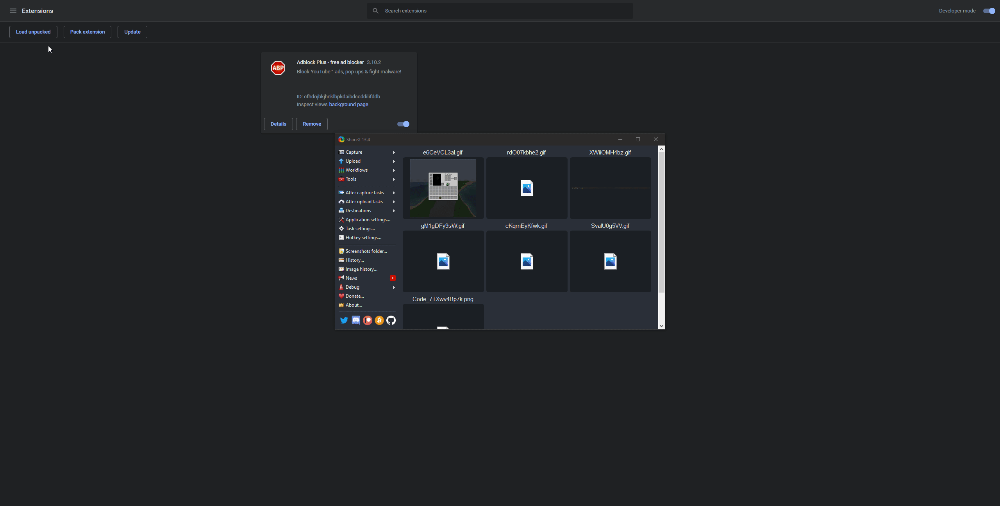

# **Youtube Media Key Fix**

### Info
  - This was just something i threw together and figured i would share
  - Feel free to contribute or fork if you want
  - yes i know its bad...

### Installation
  1. Download the project by either cloning or downloading the zip and extract it
  2. Go to `chrome://extensions` and click **load unpacked** and select the project directory
  3. Now to setup the **keybinding** go over to `chrome://extensions/shortcuts` and map it to the proper media key also make sure its on a global scope
  4. Enjoy!
  
### Example

    
### License
**MIT**
